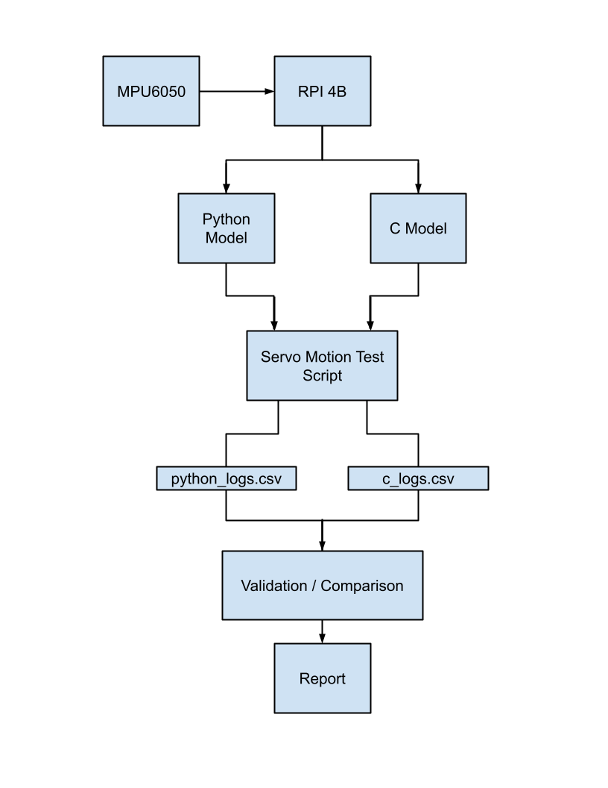

# MPU6050 IMU Validation Platform

## Overview

This project is a hardware-software validation platform built around an **MPU6050 IMU** connected to a **Raspberry Pi 4B** over **I2C**. The goal is to validate a low-level **C driver** against a **Python golden model** so that register configuration, sensor parsing, scaling, and output behavior can be checked through measurable pass/fail criteria.

The project focuses on building a repeatable validation workflow for IMU bring-up and sensor verification. By comparing the custom C device-under-test implementation against a known working Python reference, the platform helps confirm that initialization, raw data reads, and unit conversions behave as expected.

## System Architecture

The system is organized into three main layers:

1. **Hardware layer**   
    The MPU6050 communicates with the Raspberry Pi 4B over **I2C**.

    #### Wiring Diagram

    ```text
    Raspberry Pi 4B              MPU6050
    -----------------------------------------
    3.3V                     ->  VCC
    GND                      ->  GND
    GPIO3 / SCL / Pin 5      ->  SCL
    GPIO2 / SDA / Pin 3      ->  SDA
    ```

2. **Software layer**  
    Two software paths are used:
    - a **Python golden model** that serves as the reference. Adapted from the Adafruit MPU6050 driver using (`i2c-dev`) with (`ioctl`) instead of relying on the original Adafruit bus interface.
    - a **custom C driver** using the Linux **I2C userspace interface** (`i2c-dev`) with (`ioctl`) that serves as the DUT

3. **Validation layer**  
   Logged outputs from both paths are compared to evaluate:
    - device identification and register correctness
    - raw accelerometer and gyroscope agreement
    - scaling into engineering units
    - stationary bias and drift
    - response during servo-driven motion fixture for repeatable angle profiles

    Both implementations log data using the same CSV schema so they can be compared directly. Validation results are evaluated using metrics such as RMSE, maximum absolute deviation, drift, and sample-count mismatch, then checked against defined pass/fail thresholds.

## Architecture Diagram


## Final Summary

This project developed a hardware-software validation platform for an MPU6050 IMU connected to a Raspberry Pi 4B over I2C. The main goal was to validate a low-level C driver against a Python golden model so that register access, sensor parsing, scaling, and output behavior could be checked through measurable pass/fail criteria.

The Python reference model was adapted from the Adafruit MPU6050 driver structure and modified to use Linux `i2c-dev` access through `fcntl.ioctl`, `os.read`, and `os.write`. A matching C device under test (DUT) was implemented using Linux `i2c-dev`, `ioctl`, `read`, and `write`. Both implementations were designed to log accelerometer and gyroscope outputs using the same CSV schema so they could be compared directly.

To improve repeatability, a servo-driven motion fixture was built to move the MPU6050 through predefined commanded motion profiles, including static rest, step-angle tests, slow sweeps, fast sweeps, and repeated motion cycles. This made it possible to compare the Python and C implementations under the same general motion conditions rather than relying on hand motion.

A validation script was developed to compare the Python and C logs. The script checks `WHO_AM_I`, trims invalid startup rows, and computes metrics including mean absolute error, RMS error, maximum absolute deviation, drift over time, sample count mismatch, sign-consistency checks, and timestamp alignment summaries. These metrics are then evaluated against defined thresholds to determine overall PASS or FAIL.

Repeated baseline runs showed that the Python and C implementations produced consistent results under the current servo-rig setup. The `WHO_AM_I` value matched the expected device identity in both implementations, sample counts matched, and all required signals passed the current validation thresholds.

A TC7 fault-injection test was also completed by intentionally introducing an error into the C implementation. The validation framework correctly reported FAIL for the faulty case, demonstrating that the platform does not only compare two working implementations, but can also detect known implementation errors.

Overall, this project achieved its goal of building a repeatable MPU6050 validation workflow that combines embedded driver development, Linux userspace hardware access, automated log comparison, and motion-based testing. The result is a practical platform for verifying IMU driver correctness and for catching scaling, sign, parsing, and configuration errors in future driver development.